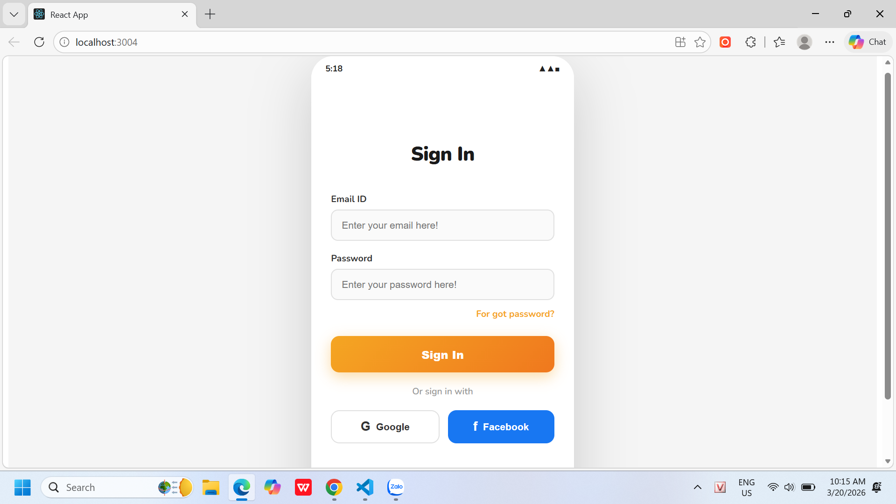
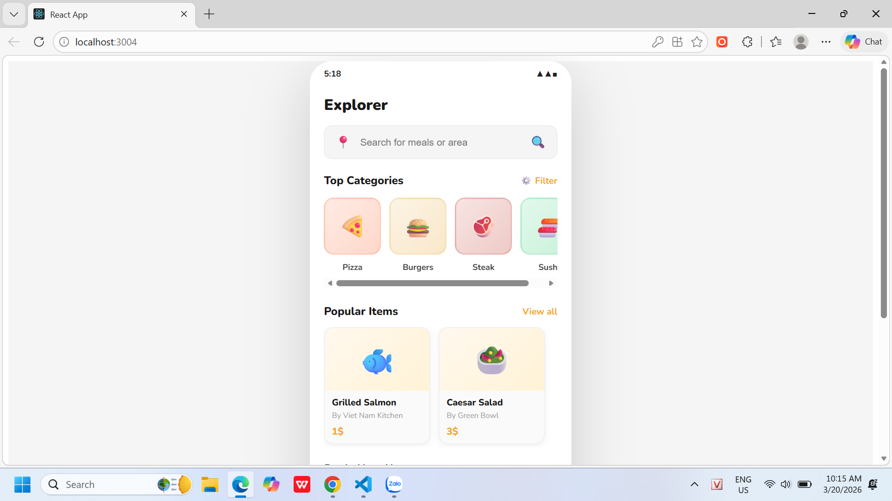
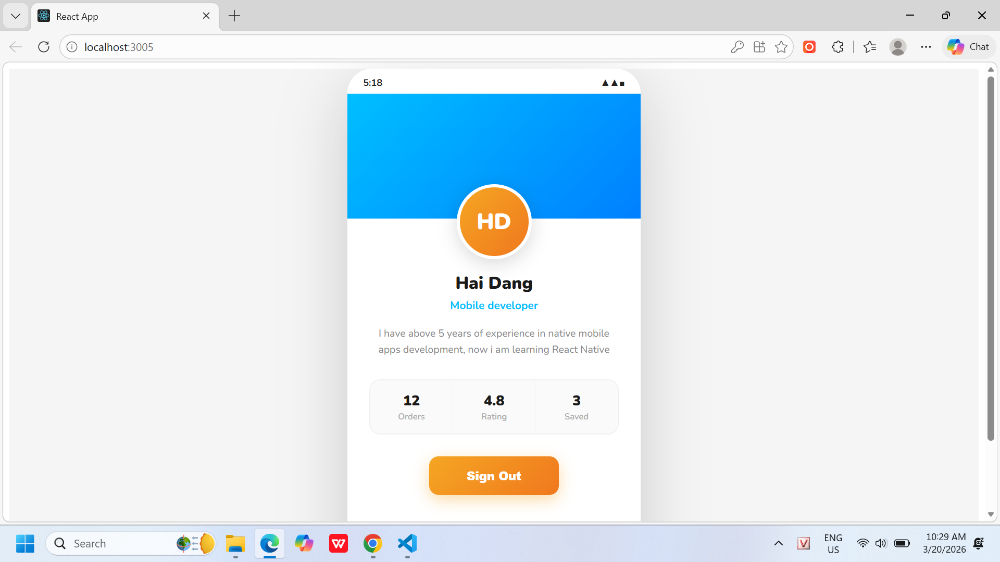

# Thực hành sử dụng Components - React Native

## Thông tin sinh viên
- Họ và tên: Đặng Quốc HẢi
- Mã sinh viên: 23810310354

## Mô tả bài tập
Sử dụng Context API hoàn thiện bài tập xây dựng luồng login cuối slide B8.pdf
Output: Link git.

## Hình ảnh kết quả chạy ứng dụng

